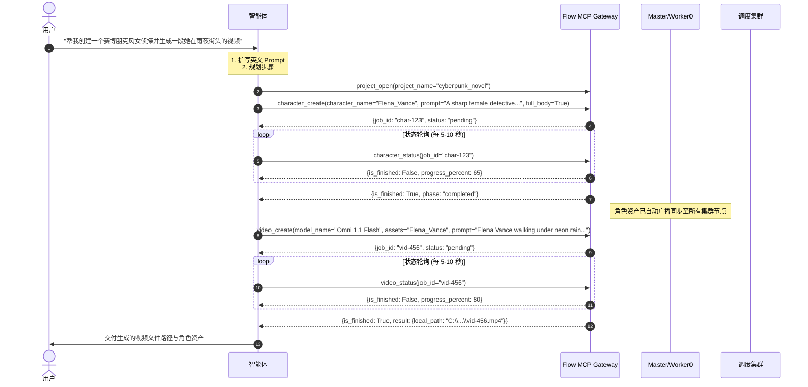

# Google Flow MCP — 智能体架构、能力全景与工具使用指南 (AGENTS.md)

本项目是 Google Agentspace Flow 集群原生 MCP 服务，专为自动化多媒体生成（虚拟角色、AI 图像、AI 视频）而设计。作为 AI 智能体，你在与本服务交互时，必须严格遵守本指南所定义的工具规范、模型矩阵、异步轮询机制与调度逻辑。

---

## 1. 系统核心能力全景

Google Flow MCP 赋予智能体对 Google Flow 自动化平台的端到端操控能力，核心包含以下四大业务支柱：

1. **虚拟角色（数字人）全生命周期管理**：
   - 基于英文 Prompt 自动生成角色头像（Portrait）与全身视图（Full-body）。
   - 支持通过本地已有参考图直接上传并固化角色。
   - 角色资产一键广播同步至集群所有执行节点，确保后续视频分镜角色一致性。
2. **多模态图像生成与素材资产入库**：
   - 纯文生图、参考图生图、宽高比适配（16:9 / 9:16）、画质下载（1K / 2K）。
   - 支持从本地上传图片素材并无缝并入项目媒体库。
3. **多模型视频生成与分布式调度**：
   - 支持多模型体系（Omni 1.1 Flash、Veo 3.1 全系列）。
   - 两种生成模式：**素材模式 (`asset`)**（文生视频 / 多参考素材驱动）与**首尾帧模式 (`frame`)**（平滑插帧与镜头过渡）。
   - 支持自动下载指定清晰度（270p / 720p / 1080p）至本地文件系统。
4. **集群智能调度与积分自治管理**：
   - 依据各节点每日 50 点免费额度及余额进行两阶段原子预占路由（`reserve -> confirm / release`）。
   - JIT（Just-In-Time）按需素材对齐，任务完成自动回传产物至 Master 统一归档。

---

## 2. 业务架构与调度机制

智能体在调度任务前，应理解背后的两类处理模型：

```
+-----------------------------------------------------------------------------------+
|                                  Master 宿主机                                    |
|  [FastMCP Gateway] <--- SSE(:8000) / Stdio --- AI 智能体 (Antigravity/OpenMontage)|
|         |                                                                         |
|         +--> [角色 / 图片任务] ---> Worker 0 (Master 本地执行)                     |
|         |                            |                                            |
|         |                            v                                            |
|         |                     Master AssetHub (本地存储 / SHA256 去重)            |
|         |                            |                                            |
|         |                            +-- gRPC 全网广播 --> [各 Worker 同名项目]   |
|         |                                                                         |
|         +--> [视频生成任务] ---> Scheduler (积分优先调度算法)                      |
|                                      |                                            |
|                                      +-- gRPC 分发 --> 最优 Worker 节点           |
|                                                            |                      |
|                                       HTTP 回传产物 <------+ (JIT拉取素材/生成视频)|
+-----------------------------------------------------------------------------------+
```

- **全量广播模型 (Full Broadcast Model，针对角色与图片)**：
  - 由 Master 本地 Worker 0 执行（0 积分消耗），生成后存入 Master AssetHub。
  - 系统自动异步将素材全量广播至所有在线 Worker 节点的同名项目中，提前完成素材分发。
- **积分优先单节点路由 (Credit-Priority Routing，针对视频生成)**：
  - 视频生成耗费积分，调度器自动根据各 Worker 的免费积分与付费余额，两阶段预占并派发给最优 Worker。
  - 若任务执行失败或排队中被取消，积分自动原路退还回滚。

---

## 3. 全量 MCP 工具定义与参数规范

### 3.1 项目管理类 (Project Management)

| 工具名称 | 描述 | 关键参数说明 | 返回值核心字段 |
|---|---|---|---|
| `website_open` | 在浏览器中打开 Google Flow 网页 | `url` (str, 默认首页) | `status`, `current_url` |
| `project_list` | 获取当前账户下所有 Google Flow 项目 | 无 | `count`, `projects` (含 `local_uuid`, `name`) |
| `project_open` | 按名称打开或切换项目（若不存在则自动新建并重命名） | `project_name` (str, 默认 "default") | `status`, `project_name`, `url` |
| `project_create` | 创建新项目（功能等同于 `project_open`） | `project_name` (str) | `status`, `project_name`, `url` |
| `project_rename` | 重命名现有项目 | `old_name` (str), `new_name` (str) | `status`, `old_name`, `new_name` |

### 3.2 虚拟角色类 (Character Management)

| 工具名称 | 描述 | 关键参数说明 | 返回值核心字段 |
|---|---|---|---|
| `character_create` | 文生虚拟角色（头像 + 全身像）。**异步任务**，0 积分消耗 | `character_name` (str, 必填)<br>`prompt` (str, 肖像全英文提示词，必填)<br>`project_name` (str, 默认 "default")<br>`model_name` (str, 默认 "Nano banana pro")<br>`full_body` (bool, 默认 True)<br>`full_body_prompt` (str, 全身像全英文提示词)<br>`voice_name` (str, 声音名称)<br>`voice_style` (str, 声音风格)<br>`download` (bool, 默认 True) | `job_id`, `status: "pending"`, `next_action` |
| `character_create_by_upload` | 通过本地图片上传创建角色。**异步任务** | `character_name` (str, 必填)<br>`portrait_image_path` (str, 本地绝对路径，必填)<br>`full_body_image_path` (str, 可选)<br>`project_name` (str, 默认 "default") | `job_id`, `status: "pending"` |
| `character_status` | 轮询角色生成进度与产物 | `job_id` (str, 必填) | `is_finished` (bool), `phase`, `progress_percent`, `result`, `error` |
| `character_list` | 列出指定项目中的所有虚拟角色 | `project_name` (str, 默认 "default") | `count`, `characters` (含头像及全身像信息) |

### 3.3 图片生成类 (Image Generation)

| 工具名称 | 描述 | 关键参数说明 | 返回值核心字段 |
|---|---|---|---|
| `image_create` | 在项目中生成图片素材。**异步任务**，0 积分消耗 | `prompt` (str, 画面全英文提示词，必填)<br>`project_name` (str, 默认 "default")<br>`aspect_ratio` (str, "16:9" 或 "9:16"，默认 "16:9")<br>`model_name` (str, 默认 "Nano Banana Pro")<br>`quantity` (int, 数量 1~4，默认 1)<br>`image_name` (str, 重命名名称，建议指定)<br>`assets` (str, 逗号分隔的参考素材名称列表)<br>`download` (str, 可选 "1K" 或 "2K"，默认 "2K") | `job_id`, `status: "pending"`, `next_action` |
| `image_create_by_upload` | 上传本地已有图片到项目素材库。**异步任务** | `image_path` (str, 本地绝对路径，必填)<br>`image_name` (str, 资产名称，必填)<br>`project_name` (str, 默认 "default") | `job_id`, `status: "pending"` |
| `image_status` | 轮询图片生成进度与产物 | `job_id` (str, 必填) | `is_finished` (bool), `phase`, `progress_percent`, `result`, `error` |
| `image_list` | 列出指定项目中的所有图片资产 | `project_name` (str, 默认 "default") | `count`, `images` (含名称、本地文件路径等) |

### 3.4 视频生成类 (Video Generation)

| 工具名称 | 描述 | 关键参数说明 | 返回值核心字段 |
|---|---|---|---|
| `video_create` | 文/图生视频。**异步任务**，依据积分自动路由调度 | `prompt` (str, 视频动作运镜全英文提示词，必填)<br>`project_name` (str, 默认 "default")<br>`model_name` (str, 默认 "Omni 1.1 Flash")<br>`mode` (str, "asset" 或 "frame"，默认 "asset")<br>`assets` (str, 逗号分隔的参考素材名，**仅 Omni 模型支持**)<br>`start_frame` (str, 首帧图片名，**仅 frame 模式有效**)<br>`end_frame` (str, 尾帧图片名，**仅 frame 模式有效**)<br>`aspect_ratio` (str, "16:9" 或 "9:16"，默认 "16:9")<br>`resolution` (str, "360p" 或 "720p"，默认 "720p"，仅 Omni 生效)<br>`duration` (int, 秒数 5~8，默认 8，仅 Omni 生效)<br>`quantity` (int, 数量 1~4，默认 1)<br>`video_name` (str, 视频重命名名称)<br>`download` (str, "270p"/"720p"/"1080p"，默认 "720p") | `job_id`, `status: "pending"`, `next_action` |
| `video_create_by_upload` | 上传本地视频至项目资产库。**异步任务** | `video_path` (str, 本地绝对路径，必填)<br>`video_name` (str, 资产名称，必填)<br>`project_name` (str, 默认 "default") | `job_id`, `status: "pending"` |
| `video_status` | 轮询视频生成进度与产物 | `job_id` (str, 必填) | `is_finished` (bool), `phase`, `progress_percent`, `progress_text`, `elapsed_seconds`, `result` (包含 `local_path` 本地视频绝对路径) |
| `video_list` | 列出指定项目中的所有视频资产 | `project_name` (str, 默认 "default") | `count`, `videos` |

### 3.5 队列调度与集群管理类 (Queue & Cluster)

| 工具名称 | 描述 | 关键参数说明 | 返回值核心字段 |
|---|---|---|---|
| `task_queue_status` | 查询集群节点负载、账户积分余额与任务队列 | 无 | `workers` (含 `daily_free`, `balance`, `phase`), `active_jobs`, `accounts` |
| `task_cancel` | 取消排队中或运行中的任务（排队中取消将自动全额退还预占积分） | `job_id` (str, 必填) | `status`, `message` |

---

## 4. 模型矩阵与计费/选型指南

智能体在协助用户生成内容时，应根据任务目标与成本合理选择模型：

| 模型分类 | 模型名称 | 积分单价 | 引用素材支持 (`assets`) | 核心优势与推荐场景 |
|---|---|---|---|---|
| **图像/角色模型** | `Nano Banana Pro` | **0 点 (免费)** | ✅ 支持多素材融合 | 全局图像生成、角色肖像与全身像构建 |
| **视频模型 (推荐)** | `Omni 1.1 Flash` | 360p: **6 点**<br>720p: **12 点** | ✅ **唯一支持引用素材**（角色、道具、参考图） | **故事分镜、角色驱动视频首选**。支持设置时长 (`duration`: 5~8s)、分辨率 (`360p`/`720p`)，性价比极高 |
| **视频模型 (自然)** | `Veo 3.1 - Lite` | **10 点** | ❌ 不支持素材引用 | 适合风景、自然空镜头、气氛烘托等纯文本驱动镜头 |
| **视频模型 (高速)** | `Veo 3.1 - Fast` | **20 点** | ❌ 不支持素材引用 | 快速构思验证、镜头运动与动态预览 |
| **视频模型 (电影级)** | `Veo 3.1 - Quality` | **100 点** | ❌ 不支持素材引用 | 终极成品渲染、高细节特写、复杂物理光影 |

> [!IMPORTANT]
> **免费积分规则**：每个 Worker 绑定的 Google 账号每日获得 **50 点免费积分**，于每天 **UTC 05:00**（北京时间 13:00）自动重置。智能体应优先利用各节点的免费积分额度。

---

## 5. 智能体行为铁律 (Critical Agent Rules)

为了确保调用链路的稳定性，智能体**必须无条件执行**以下 5 条铁律：

### 铁律 1：全异步长任务轮询机制 (Asynchronous Polling)
- 所有生成类工具（`character_create`、`image_create`、`video_create`）均为**异步触发**，成功调用后**仅返回任务凭证 `job_id`**，绝不代表任务完成。
- **严禁**：因看到 `status: "pending"` 或 `phase: "queued"` 认为失败而盲目重试！
- **必须**：
  1. 记录返回的 `job_id`。
  2. 循环调用对应的 `*_status(job_id)` 工具进行状态轮询。
  3. 轮询间隔：推荐 **5 ~ 10 秒** 查询一次。
  4. 终态判定：以响应体中的 **`is_finished == True`** 作为唯一终止轮询标志。任务完成时，产物路径将存在于 `result.local_path` 中。

### 铁律 2：全英文提示词规范 (English Only for Prompts)
- Google Flow 底层大模型仅在接收**全英文 Prompt** 时表现最佳。
- 当用户输入中文需求时，智能体**必须在内部将内容翻译并扩写为生动、具象的高质量英文 Prompt**（包含主体细节、光影 Lighting、风格 Style、镜头角度 Camera Angle 与动作 Action），再传给工具。

### 铁律 3：素材模式与模型约束
- 只有 `Omni 1.1 Flash` 模型支持在 `assets` 参数中传入角色或图片名称进行形象保持。
- 若选用 `Veo 3.1` 系列模型，请勿传入 `assets`（Veo 模型无法消费该字段）。
- 若需要生成两张静态图之间的转场镜头，请使用 `mode="frame"`，并分别指定 `start_frame` 与 `end_frame`。

### 铁律 4：资产命名与空格自动转换
- 命名角色、图片、视频（`character_name`, `image_name`, `video_name`）时，若包含空格，系统底层将自动转换为下划线 `_`。
- 在后续工具引用这些资产时，请保持名称拼写一致。

### 铁律 5：项目上下文隔离
- 建议在执行批次任务前，显式调用一次 `project_open(project_name="...")`，确保当前自动化环境绑定在目标工程中，避免多任务相互污染。

---

## 6. 典型标准工作流范式 (Standard Workflow Recipes)

### 场景 A：从零创建数字人并生成连续剧视频


### 场景 B：首尾帧过渡连贯镜头生成 (Frame Interpolation)
1. **生成首帧**：调用 `image_create(image_name="shot1_start", prompt="Wide shot of sunrise over castle...")`，轮询 `image_status` 直至 `is_finished == True`。
2. **生成尾帧**：调用 `image_create(image_name="shot1_end", prompt="Close up of castle gates opening...")`，轮询 `image_status` 直至 `is_finished == True`。
3. **首尾帧生视频**：调用 `video_create(mode="frame", start_frame="shot1_start", end_frame="shot1_end", prompt="Smooth camera push towards the opening gates...")`。
4. **轮询交付**：轮询 `video_status` 直至获取到本地视频文件。

### 场景 C：集群巡检与排队自愈
- 当需要检查集群健康度或评估积分是否充足时，调用 `task_queue_status` 查看在线 Worker 列表及各节点可用积分。
- 若用户中途希望取消长耗时排队任务，调用 `task_cancel(job_id)`，系统将自动退还已锁定的积分配额。

---

## 7. 服务运行控制与自检 (Unified Scripts)

当工具报错连接超时或浏览器未就绪时，智能体可指导用户或通过终端使用统一脚本进行自检与拉起：

- **控制台交互式菜单**：直接运行 `.\flow_mcp.bat`（或 `.\flow_mcp.ps1`）。
- **统一参数化命令（末尾统一规范为 `[status|start|stop]`，所有配置默认从 `.env` 读取，无需且不许在命令行传参）**：
  - `.\flow_mcp.bat master [status|start|stop]`：管理 Master 核心网关（端口 8000/8765/50051 及本地 Worker 0）
  - `.\flow_mcp.bat worker [status|start|stop]`：管理分布式 Worker 执行节点（Worker ID、Master 连接目标自 `.env` 自动载入）
  - `.\flow_mcp.bat browser [status|start|stop]`：管理 Chrome 自动化浏览器实例
  - `.\flow_mcp.bat status`：全局综合健康巡检（Master、Worker、浏览器及集群积分池）
  - `.\flow_mcp.bat stop`：一键停止集群后台服务（Master + Worker）

---

## 8. 消费端配置参考

- **全局 MCP 注册文件**：`C:\Users\zgh\.gemini\config\mcp_config.json`
  ```json
  {
    "mcpServers": {
      "flow-mcp": {
        "serverUrl": "http://127.0.0.1:8000/sse"
      }
    }
  }
  ```
- **外部适配器**：OpenMontage 集成适配器位于 `c:\dev\ai\OpenMontage\tools\video\flow_mcp_adapter.py`。
